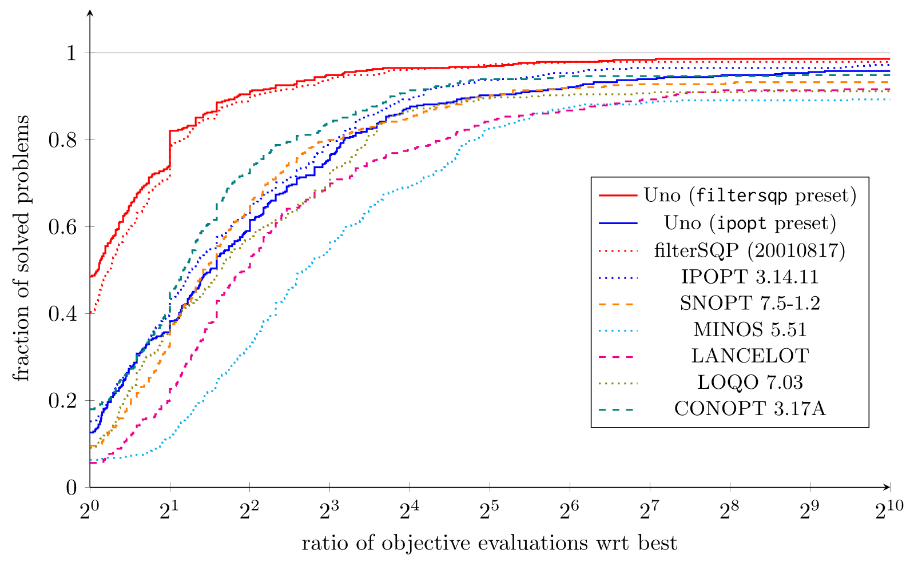

<p align="center">
   
</p>

# Uno (Unifying Nonlinear Optimization)

Uno is a C++ library for solving nonlinearly constrained optimization problems of the form:

$$
\begin{align}
\min_{x \in \mathbb{R}^n}  & ~f(x) \\
\text{s.t.}                & ~c_L \le c(x) \le c_U \\
                           & ~x_L \le x \le x_U \\
\end{align}
$$

where $f: \mathbb{R}^n \rightarrow \mathbb{R}$ and $c: \mathbb{R}^n \rightarrow \mathbb{R}^m$ are (ideally twice) continuously differentiable.

Uno unifies Lagrange-Newton (essentially **SQP** and **interior-point**) methods that iteratively solve the optimality (KKT) conditions with Newton's method. It breaks them down into a set of building blocks that interact with one another. Our unification framework can be visualized in the following hypergraph (not all are implemented in Uno yet):

<p align="center">
   
</p>

You can combine these strategies in a ton of different ways via [options](docs/options.md). Uno also implements **presets**, that is strategy combinations that mimic existing solvers:
* `filtersqp` mimics filterSQP (trust-region feasibility restoration filter SQP method with exact Hessian);
* `ipopt` mimics IPOPT (line-search feasibility restoration filter barrier method with exact Hessian and primal-dual inertia correction).

Note that all combinations do not necessarily result in sensible algorithms, or even convergent approaches.

For more details on our unification theory, check out the [UNIFICATION](UNIFICATION.md) page, our [preprint](https://www.researchgate.net/publication/397446552_Implementing_a_unified_solver_for_nonlinearly_constrained_optimization), or my [latest slides](https://www.researchgate.net/publication/390271091).

## Installation instructions

See the [INSTALL](INSTALL.md) file for instructions on how to compile Uno from source or use the precompiled libraries and executables.

## Interfaces

### AMPL/nl files
Uno's AMPL executable can be compiled via the command `make uno_ampl` and requires the [AMPL Solver Library (ASL)](https://www.netlib.org/ampl/solvers/). For more details, see the [README.md](interfaces/AMPL/README.md).

### Julia
Uno can be used from Julia in two ways:

1. **Pure Julia interface**:
   [UnoSolver.jl](https://github.com/cvanaret/Uno/tree/main/interfaces/Julia) is the native Julia interface to [Uno](https://github.com/cvanaret/Uno).
   It provides direct integration with the Julia optimization ecosystem through:
   - a thin wrapper around the full C API,
   - an interface to [NLPModels.jl](https://github.com/JuliaSmoothOptimizers/NLPModels.jl) for solving problems following the NLPModels API, such as [CUTEst](https://github.com/JuliaSmoothOptimizers/CUTEst.jl), [ADNLPModels.jl](https://github.com/JuliaSmoothOptimizers/ADNLPModels.jl), or [ExaModels.jl](https://github.com/exanauts/ExaModels.jl),
   - an interface to [MathOptInterface.jl](https://github.com/jump-dev/MathOptInterface.jl) for handling [JuMP](https://github.com/jump-dev/JuMP.jl) models.

   Under the hood, `UnoSolver.jl` uses precompiled shared libraries from [Uno_jll.jl](https://github.com/JuliaBinaryWrappers/Uno_jll.jl) while exposing a high-level Julia API.
   More details can be found in the [README](https://github.com/cvanaret/Uno/tree/main/interfaces/Julia) of `UnoSolver.jl`.
   This is the recommended way of using Uno in Julia.

2. **AMPL interface**:
   Alternatively, the executable `uno_ampl` can be installed via [Uno_jll.jl](https://github.com/JuliaBinaryWrappers/Uno_jll.jl) and used through [AmplNLWriter.jl](https://juliahub.com/ui/Packages/General/AmplNLWriter.jl).
   An example can be found [here](https://discourse.julialang.org/t/the-uno-unifying-nonconvex-optimization-solver/115883/21).

### Python
Uno's Python bindings can be compiled via the command `make unopy` and require [pybind11](https://github.com/pybind/pybind11). For more details, see their [README.md](interfaces/Python/README.md).

### C
Uno's C interface is compiled as part of the Uno library. For more details, see its [README.md](interfaces/C/README.md).
It may be modified in future minor releases.

## Latest results (August 13, 2025)

Uno presets have been tested against state-of-the-art solvers on 429 small problems of the [CUTEst benchmark](https://arnold-neumaier.at/glopt/coconut/Benchmark/Library2_new_v1.html).
The figure below is a performance profile of Uno and state-of-the-art solvers filterSQP, IPOPT, SNOPT, MINOS, LANCELOT, LOQO and CONOPT; it shows how many problems are solved for a given budget of function evaluations (1 time, 2 times, 4 times, ..., $2^x$ times the number of objective evaluations of the best solver for each instance).

<p align="center">
   
</p>

All log files can be found [here](https://github.com/cvanaret/nonconvex_solver_comparison).

## How to cite Uno

We have submitted our paper to the Mathematical Programming Computation journal. The preprint is available on [ResearchGate](https://www.researchgate.net/publication/397446552_Implementing_a_unified_solver_for_nonlinearly_constrained_optimization).

Until it is published, you can use the following bibtex entry:

```
@unpublished{VanaretLeyffer2024,
  author = {Vanaret, Charlie and Leyffer, Sven},
  title = {Implementing a unified solver for nonlinearly constrained optimization},
  year = {2024},
  note = {Submitted to Mathematical Programming Computation}
}
```

## Credits

The theoretical abstract framework for unifying nonlinearly constrained optimization was developed by [Charlie Vanaret](https://github.com/cvanaret/) (Argonne National Laboratory & Zuse-Institut Berlin) and [Sven Leyffer](https://wiki.mcs.anl.gov/leyffer/index.php/Sven_Leyffer) (Argonne National Laboratory). Uno was designed and implemented by Charlie Vanaret. It is released under the MIT license (see the [license file](LICENSE)).

The contributors are (in alphabetical order):
[Oscar Dowson](https://github.com/odow), [Marcel Jacobse](https://github.com/mjacobse), [Arnav Kapoor](https://github.com/arnavk23), [David Kiessling](https://github.com/david0oo), [Rujia Liu](https://github.com/rujialiu), [Stefano Lovato](https://github.com/stefphd), [Alexis Montoison](https://github.com/amontoison), [Manuel Schaich](https://github.com/worc4021), [Silvio Traversaro](https://github.com/traversaro).

The Uno logo was created by Charlie Vanaret based on a [saddle point icon by luimonts](https://thenounproject.com/icon/saddle-point-258207/) (CC BY 3.0).
