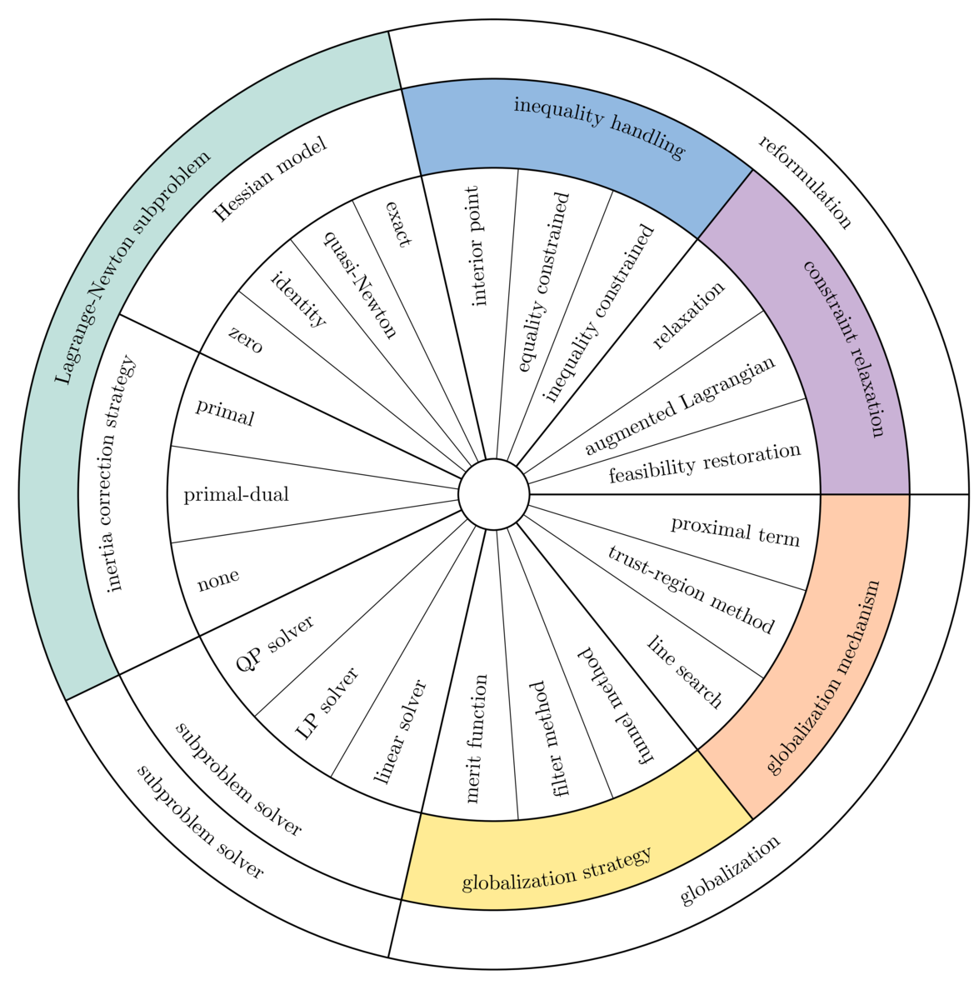

# Uno

<div align="center">

   *A modern, modular solver for nonlinearly constrained optimization*

</div>

Uno (Unifying Nonlinear Optimization) is a C++ library that unifies methods for solving nonlinearly constrained optimization problems of the form:

$$
\begin{align}
\min_{x \in \mathbb{R}^n}  & ~f(x) \\
\text{s.t.}                & ~c_L \le c(x) \le c_U \\
                           & ~x_L \le x \le x_U \\
\end{align}
$$

where $f: \mathbb{R}^n \rightarrow \mathbb{R}$ and $c: \mathbb{R}^n \rightarrow \mathbb{R}^m$ are (ideally twice) continuously differentiable.

We consider the family of **Lagrange-Newton (essentially SQP and interior-point) methods** that iteratively solve the optimality (KKT) conditions with Newton's method, and we argue that most Lagrange-Newton methods can be broken down into the following generic ingredients:
* a **constraint relaxation strategy**: a systematic way to relax the general constraints;
* an **inequality handling method**: a systematic way to handle the inequality constraints;
* a **Lagrange-Newton subproblem**: a local Lagrange-Newton approximation of the reformulated problem, composed of:
	* a **Hessian model**: a model of the Lagrangian Hessian of the original problem;
	* a **regularization strategy**: a strategy to regularize the Lagrangian Hessian or the augmented system of the reformulated problem;
* a **globalization strategy**: an acceptance test of the trial iterate;
* a **globalization mechanism**: a recourse action upon rejection of the trial iterate.

The following graph gives an overview of state-of-the-art strategies:
<p align="center">
   
</p>

**Any strategy combination** can be automatically generated without any programming effort from the user. Note that all combinations do not necessarily result in sensible algorithms, or even convergent approaches. For more details, check out our [preprint](https://www.researchgate.net/publication/381522383_Unifying_nonlinearly_constrained_nonconvex_optimization) or my [latest slides](https://www.researchgate.net/publication/390271091).

Uno implements **presets**, that is strategy combinations that correspond to existing solvers (as well as hyperparameter values found in their documentations):
* `filtersqp` mimics filterSQP (trust-region feasibility restoration filter SQP method with exact Hessian);
* `ipopt` mimics IPOPT (line-search feasibility restoration filter barrier method with exact Hessian and primal-dual regularization).

## Installation instructions

See the [INSTALL](INSTALL.md) file for instructions on how to compile Uno from source or use the precompiled libraries and executables.

## Interfaces

### AMPL/nl files
To solve an AMPL model in the [.nl format](https://en.wikipedia.org/wiki/Nl_(format)), move to the `build` directory and:
- run `cmake` with the path to the ASL library: `-DAMPLSOLVER=path`;
- compile the executable ```make uno_ampl```.
- run the command ```./uno_ampl model.nl [-AMPL] [option=value ...]``` where ```[option=value ...]``` is a list of options separated by spaces. If the `-AMPL` flag is supplied, the solution is written to the AMPL solution file `model.sol`.

For an overview of the available strategies, type: ```./uno_ampl --strategies```:

A couple of CUTEst instances are available in the `/examples` directory.

### Julia
Uno can be used from Julia in two ways:

1. **Pure Julia interface**:
   [Uno.jl](https://github.com/cvanaret/Uno/tree/main/interfaces/Julia) is the native Julia interface to [Uno](https://github.com/cvanaret/Uno).
   It provides direct integration with the Julia optimization ecosystem through:
   - a thin wrapper around the full C API,
   - an interface to [NLPModels.jl](https://github.com/JuliaSmoothOptimizers/NLPModels.jl) for solving problems following the NLPModels API, such as [CUTEst](https://github.com/JuliaSmoothOptimizers/CUTEst.jl), [ADNLPModels.jl](https://github.com/JuliaSmoothOptimizers/ADNLPModels.jl), or [ExaModels.jl](https://github.com/exanauts/ExaModels.jl),
   - an interface to [MathOptInterface.jl](https://github.com/jump-dev/MathOptInterface.jl) for handling [JuMP](https://github.com/jump-dev/JuMP.jl) models.

   Under the hood, `Uno.jl` uses precompiled shared libraries from [Uno_jll.jl](https://github.com/JuliaBinaryWrappers/Uno_jll.jl) while exposing a high-level Julia API.
   More details can be found in the [README](https://github.com/cvanaret/Uno/tree/main/interfaces/Julia) of `Uno.jl`.
   This is the recommended way of using Uno in Julia.

2. **AMPL interface**:
   Alternatively, the executable `uno_ampl` can be installed via [Uno_jll.jl](https://github.com/JuliaBinaryWrappers/Uno_jll.jl) and used through [AmplNLWriter.jl](https://juliahub.com/ui/Packages/General/AmplNLWriter.jl).
   An example can be found [here](https://discourse.julialang.org/t/the-uno-unifying-nonconvex-optimization-solver/115883/21).

### Python
Uno's Python bindings can be compiled via the command `make unopy` and require pybind11. For more details, see their [README.md](interfaces/Python/README.md).

### C
Uno's C interface is compiled as part of the Uno library. For more details, see its [README.md](interfaces/C/README.md).
It may be modified in future minor releases.

## Solving a problem with Uno

### Controlling Uno via options

Options can be set in three different ways (with decreasing precedence):
- passing an option file (`option_file=file`) that contains `option value` on each line;
- setting a preset that mimics an existing solver (`preset=[filtersqp|ipopt]`);
- setting individual options (see the [default options](https://github.com/cvanaret/Uno/blob/main/uno/options/DefaultOptions.cpp)).

### Combining strategies on the fly

The following ingredients are currently available:
- to pick a constraint relaxation strategy, use the argument: ```constraint_relaxation_strategy=[feasibility_restoration]```  
- to pick an inequality handling method, use the argument: ```inequality_handling_method=[inequality_constrained|primal_dual_interior_point]``` 
- to pick a Hessian model, use the argument: ```hessian_model=[exact|identity|zero]``` 
- to pick a regularization strategy, use the argument: ```regularization_strategy=[primal|primal_dual|none]``` 
- to pick a globalization strategy, use the argument: ```globalization_strategy=[l1_merit|fletcher_filter_method|waechter_filter_method|funnel_method]```   
- to pick a globalization mechanism, use the argument : ```globalization_mechanism=[TR|LS]```  

## Latest results (August 13, 2025)

Uno presets have been tested against state-of-the-art solvers on 429 small problems of the [CUTEst benchmark](https://arnold-neumaier.at/glopt/coconut/Benchmark/Library2_new_v1.html).
The figure below is a performance profile of Uno and state-of-the-art solvers filterSQP, IPOPT, SNOPT, MINOS, LANCELOT, LOQO and CONOPT; it shows how many problems are solved for a given budget of function evaluations (1 time, 2 times, 4 times, ..., $2^x$ times the number of objective evaluations of the best solver for each instance).

<p align="center">
   
</p>

All log files can be found [here](https://github.com/cvanaret/nonconvex_solver_comparison).

## How to cite Uno

### In an article

We have submitted our paper to the Mathematical Programming Computation journal. The preprint is available on [ResearchGate](https://www.researchgate.net/publication/381522383_Unifying_nonlinearly_constrained_nonconvex_optimization).

Until it is published, you can use the following bibtex entry:

```
@unpublished{VanaretLeyffer2024,
  author = {Vanaret, Charlie and Leyffer, Sven},
  title = {Unifying nonlinearly constrained nonconvex optimization},
  year = {2024},
  note = {Submitted to Mathematical Programming Computation}
}
```

### On social media

To mention Uno on Twitter, use [@UnoSolver](https://twitter.com/UnoSolver).  
To mention Uno on LinkedIn, use [#unosolver](https://www.linkedin.com/feed/hashtag/?keywords=unosolver).  

## Credits

The theoretical abstract framework for unifying nonlinearly constrained optimization was developed by [Charlie Vanaret](https://github.com/cvanaret/) (Argonne National Laboratory & Zuse-Institut Berlin) and [Sven Leyffer](https://wiki.mcs.anl.gov/leyffer/index.php/Sven_Leyffer) (Argonne National Laboratory). Uno was designed and implemented by Charlie Vanaret. It is released under the MIT license (see the [license file](LICENSE)).

The contributors are (in alphabetical order):
[Oscar Dowson](https://github.com/odow), [Marcel Jacobse](https://github.com/mjacobse), [David Kiessling](https://github.com/david0oo), [Alexis Montoison](https://github.com/amontoison), [Rujia Liu](https://github.com/rujialiu), [Manuel Schaich](https://github.com/worc4021), [Silvio Traversaro](https://github.com/traversaro).

The Uno logo was created by Charlie Vanaret based on a [saddle point icon by luimonts](https://thenounproject.com/icon/saddle-point-258207/) (CC BY 3.0).
