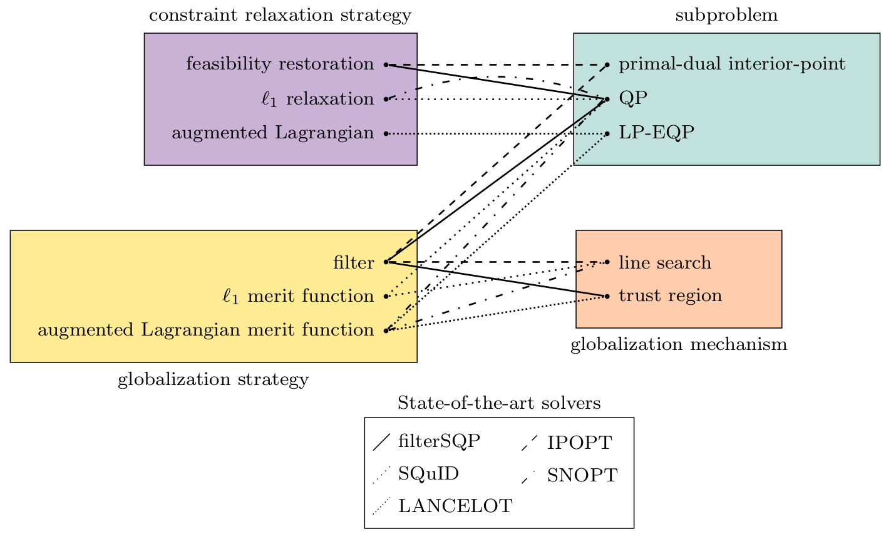
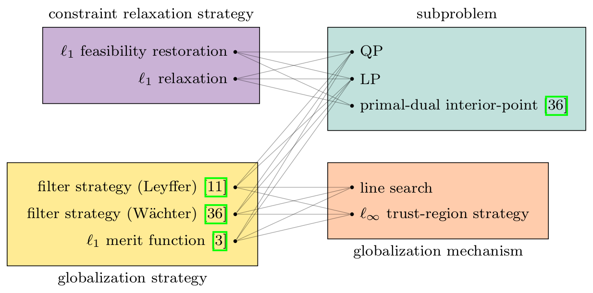

# Uno (Unifying Nonlinear Optimization)

## What is Uno?

Uno (Unifying Nonlinear Optimization) is a C++ library that unifies methods for solving nonlinearly constrained optimization problems of the form:

$$
\begin{align}
\min_{x \in \mathbb{R}^n}  & ~f(x) \\
\text{s.t.}                & ~c_L \le c(x) \le c_U \\
                           & ~x_L \le x \le x_U \\
\end{align}
$$

Uno breaks downs optimization methods into four generic ingredients:
* a **constraint relaxation strategy**: a systematic way to relax the nonlinear constraints;
* a **subproblem**: a local model of the (possibly relaxed) problem at the current primal-dual iterate;
* a **globalization strategy**: an acceptance test of the trial iterate;
* a **globalization mechanism**: a recourse action upon rejection of the trial iterate.

The following hypergraph illustrates how some of the state-of-the-art solvers can be decomposed in terms of the four ingredients:
<p align="center">
   
</p>

### Uno 1.0

Uno 1.0 implements the following strategies:
<p align="center">
   
</p>

**Any strategy combination** can be automatically generated without any programming effort from the user. Note that all combinations do not necessarily result in sensible algorithms, or even convergent approaches.

For more details, check out my [presentation at the ICCOPT 2022 conference](https://www.researchgate.net/publication/362254109).
This is joint work with [Sven Leyffer](https://wiki.mcs.anl.gov/leyffer/index.php/Sven_Leyffer) (Argonne National Laboratory).

### Latest results (April 27, 2023)

Some of Uno combinations that correspond to existing solvers (called presets, see below) have been tested against state-of-the-art solvers on 429 small problems of the [CUTEst benchmark](https://arnold-neumaier.at/glopt/coconut/Benchmark/Library2_new_v1.html).
The figure below is a performance profile; it shows how many problems are solved for a given budget of function evaluations (1 time, 2 times, 4 times, ..., $2^x$ times the number of objective evaluations of the best solver for each instance).

<p align="center">
   
</p>

## How to cite Uno

Please be patient, we are actively working on our article.

## Contributions

Uno was designed and implemented by [Charlie Vanaret](https://github.com/cvanaret/) (Zuse-Institut Berlin).  
The theoretical abstract framework for unifying nonlinear optimization was developed by Charlie Vanaret and Sven Leyffer.

[Silvio Traversaro](https://github.com/traversaro) contributed to the CMakeLists.

## License

Uno is released under the MIT license (see the [license file](LICENSE)).

## Installation instructions

### Packages and libraries

* download the AMPL solver library (ASL): http://www.netlib.org/ampl/solvers/

* download **optional** solvers:
    * BQPD (indefinite null-space QP solver): https://www.mcs.anl.gov/~leyffer/solvers.html
    * MA57 (sparse indefinite symmetric linear solver): http://www.hsl.rl.ac.uk/catalogue/ma57.html

* install BLAS and LAPACK: ```sudo apt-get install libblas-dev liblapack-dev```
* install cmake (and optionally ccmake, CMake curses interface): ```sudo apt-get install cmake cmake-curses-gui```

### Compilation

1. Create a `build` directory in the main directory: ```mkdir build```
2. Move to the build directory: ```cd build/```
3. Type cmake (``Release`` can be replaced with ``Debug``): ```cmake -DCMAKE_BUILD_TYPE=Release ..```
4. **(optional)** Use ccmake to provide the paths to the required and optional libraries: ```ccmake ..```
5. Compile (in parallel: `n` being the number of threads, e.g. 6): ```make -jn```

To compile the code with different configurations, simply create a `build` directory for each configuration and perform instructions 1 to 5.

### Unit tests

6. Install the GoogleTest suite: ```sudo apt-get install googletest```
7. Perform steps 2 and 3
8. Run the test suite: ```./run_unotest```

### Autocompletion

To benefit from autocompletion, install the file `uno_ampl-completion.bash`: ```sudo cp uno_ampl-completion.bash /etc/bash_completion.d/```
and open a new terminal.

## Solving a problem with Uno

To solve an AMPL model, type in the `build` directory: ```./uno_ampl path_to_file/file.nl```
A couple of CUTEst instances are available in the `/examples` directory.

### Combination of ingredients

To pick a globalization mechanism, use the argument (choose one of the possible options in brackets): ```-globalization_mechanism [LS|TR]```  
To pick a constraint relaxation strategy, use the argument: ```-constraint_relaxation_strategy [feasibility_restoration|l1_relaxation]```  
To pick a globalization strategy, use the argument: ```-globalization_strategy [l1_merit|leyffer_filter_strategy|waechter_filter_strategy]```  
To pick a subproblem method, use the argument: ```-subproblem [QP|LP|primal_dual_interior_point]```  
The options can be combined in the same command line.

For an overview of the available strategies, type: ```./uno_ampl --strategies```

### Presets

Uno presets are strategy combinations that correspond to existing solvers (as well as known values for their hyperparameters). Uno 1.0 implements three presets:
* `filtersqp` mimics filterSQP (trust-region feasibility restoration filter SQP method);
* `ipopt` mimics IPOPT (line-search feasibility restoration filter barrier method);
* `byrd` mimics Byrd's S $\ell_1$ QP (line-search $\ell_1$ merit S $\ell_1$ QP method).

To pick a preset, use the argument: ```-preset [filtersqp|ipopt|byrd]```
