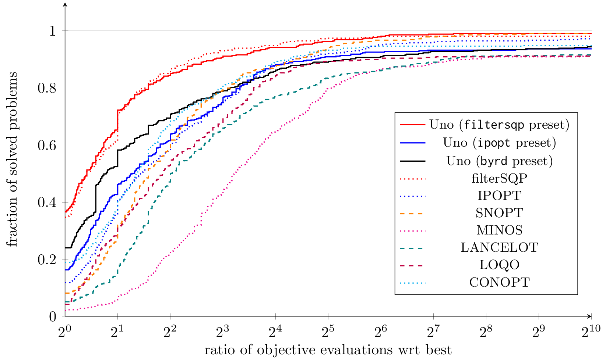

# CUTE benchmark

Uno presets have been tested against state-of-the-art solvers on 429 small problems of the [CUTE benchmark](https://arnold-neumaier.at/glopt/coconut/Benchmark/Library2_new_v1.html).
The figure below (datedAugust 13, 2025) is a performance profile of Uno and state-of-the-art solvers filterSQP, IPOPT, SNOPT, MINOS, LANCELOT, LOQO and CONOPT; it shows how many problems are solved for a given budget of function evaluations (1 time, 2 times, 4 times, ..., $2^x$ times the number of objective evaluations of the best solver for each instance).

   

All log files can be found [here](https://github.com/cvanaret/nonconvex_solver_comparison).