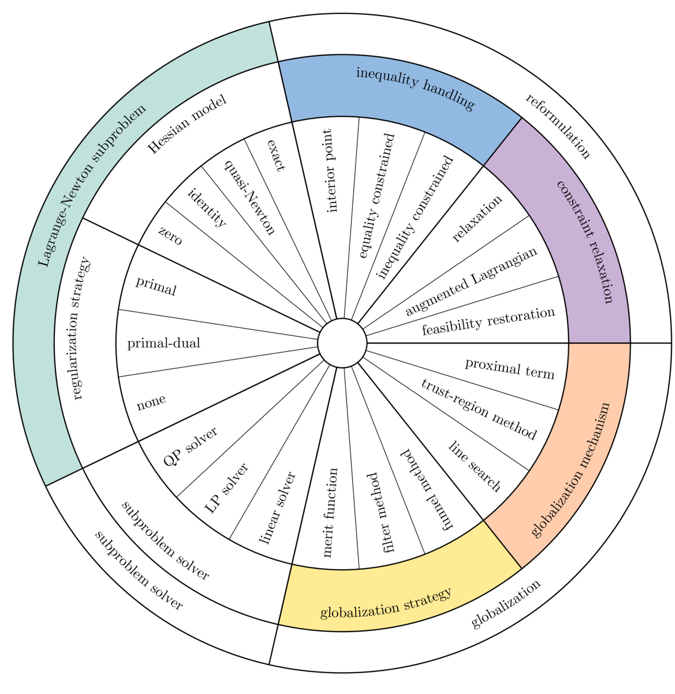
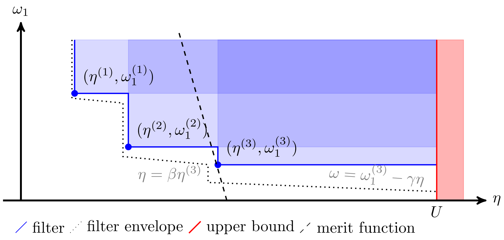

# Unification framework

## Notation and stationarity conditions

### Notation

We start by defining the scaled Lagrangian or Fritz John function of (NLP) at $(x, y, z, \pi)$:

$$\mathcal{L}_\pi(x, y, z) \stackrel{\text{def}}{=} \pi f(x) - y^T c(x) - z^T x = \pi f(x) - \sum_{j=1}^m y_j c_j(x) - \sum_{i=1}^n z_i x_i,$$

where $y$ and $z \ge 0$ are the Lagrange multipliers of the general constraints $c(x) = 0$ and the bound constraints $x \ge 0$, respectively, and $\pi \ge 0$ is an objective multiplier that is introduced to handle infeasibility or lack of constraint qualification (CQ) in a consistent way.

$\nabla_x \mathcal{L}_\pi(x, y, z)$ is the gradient of the scaled Lagrangian with respect to $x$:

$$\nabla_x \mathcal{L}_\pi(x, y, z) \stackrel{\text{def}}{=} \pi \nabla f(x) - \sum_{j=1}^m y_j \nabla c_j(x) - z.$$

$\nabla^2_{xx} \mathcal{L}_\pi(x, y)$ is the Hessian of the scaled Lagrangian with respect to $x$:

$$\nabla^2_{xx} \mathcal{L}_\pi(x, y) = \pi \nabla^2 f(x) - \sum_{j=1}^m y_j \nabla^2 c_j(x).$$

### First-order stationarity conditions

We are primarily concerned with first-order stationary points. The first-order optimality conditions (aka Fritz John conditions) of problem (NLP) at a stationary point $x^*$ state that there exist $(\pi^*, y^*, z^*)$ such that:

$$\text{(stationarity)} \quad \nabla_x \mathcal{L}_{\pi^*}(x^*, y^*, z^*) = 0$$

$$\text{(primal feasibility)} \quad c(x^*) = 0, \quad x^* \ge 0$$

$$\text{(dual feasibility)} \quad \pi^* \ge 0, \quad z_i^* \geq 0, \quad (\pi^*, y^*, z^*) \not= (0, 0, 0)$$

$$\text{(complementarity)} \quad x_i^* z_i^* = 0, \quad \forall i \in \{1, \ldots, n\}.$$

If $\pi^* > 0$, the optimality conditions are equivalent to the KKT conditions, which can be recovered by scaling the stationarity equation by $1/\pi^*$. If $\pi^* = 0$, they characterize Fritz John points, that is, feasible points at which a constraint qualification is violated.

## A unifying framework for nonlinearly constrained optimization

A local quadratic approximation of (NLP) at iteration $k$ about the current primal-dual point is given by:

$$
\begin{array}{ll} \displaystyle
\min_x      & \frac{1}{2} (x - x^{(k)})^T H^{(k)} (x - x^{(k)}) + (\nabla f^{(k)})^T (x - x^{(k)}) \\
\mbox{s.t.} & c^{(k)} + (\nabla c^{(k)})^T (x - x^{(k)}) = 0 \\
				& x \ge 0,
\end{array}
$$

where $H(x, y)$ is any approximation of $\nabla^2_{xx} \mathcal{L}_\pi(x, y)$, and the superscript $(k)$ denotes evaluation at the current iterate. For convex equality-constrained problems, an iteration can be interpreted as taking a Newton step on the first-order optimality conditions of the problem, hence the name *Lagrange-Newton methods*.

In this section we introduce a unified view for describing Lagrange-Newton methods and argue that they can be assembled by combining **eight generic building blocks or *ingredients***. These ingredients are organized in four layers:

- the **reformulation** layer:
  - a **constraint relaxation strategy** constructs feasible subproblems by relaxing the general constraints;
  - an **inequality handling method** handles the inequality constraints;
- the **subproblem** layer:
  - a **Hessian model** determines the approximation of the Lagrangian Hessian;
  - an **inertia correction strategy** corrects the inertia of the Lagrangian Hessian or of the KKT matrix;
- the **subproblem solver** layer:
  - a **subproblem solver** approximately solves the subproblem by exploiting its characteristics, such as convexity, presence of constraints, presence of bounds, and presence of inequality constraints;
- the **globalization** layer:
  - a **globalization strategy** determines whether a trial iterate makes sufficient progress toward a solution and accepts or rejects it; and
  - a **globalization mechanism** controls the length of the direction and defines the recourse action taken when a trial iterate is rejected.

The role of each ingredient is shown in the following abstract algorithm.

**Algorithm 1 (Abstract algorithm).**

> **Input:** initial point $(x^{(0)}, y^{(0)}, z^{(0)})$  
> Set $k \gets 0$  
> **while** termination criteria at $(x^{(k)}, y^{(k)}, z^{(k)})$ not met **do**  
> &emsp;**repeat**  
> &emsp;&emsp;Solve a (sequence of) feasible subproblem(s) that approximate(s) (NLP) at $(x^{(k)}, y^{(k)}, z^{(k)})$  
> &emsp;&emsp;Assemble trial iterate $(\hat{x}^{(k+1)}, \hat{y}^{(k+1)}, \hat{z}^{(k+1)})$  
> &emsp;**until** $(\hat{x}^{(k+1)}, \hat{y}^{(k+1)}, \hat{z}^{(k+1)})$ is acceptable  
> &emsp;Update $(x^{(k+1)}, y^{(k+1)}, z^{(k+1)}) \gets (\hat{x}^{(k)}, \hat{y}^{(k)}, \hat{z}^{(k)})$  
> &emsp;$k \gets k + 1$  
> **end while**  
> **Output:** $(x^{(k)}, y^{(k)}, z^{(k)})$

The inner loop (**repeat**) generates and solves a feasible subproblem (possibly a sequence of feasible subproblems) until a trial iterate is accepted by the globalization strategy, and the outer loop (**while**) generates a sequence of acceptable iterates until termination.

The "wheel of strategies" below organizes a wide range of strategies into a coherent hierarchy. The outer layer represents the optimization layers, the middle layer represents the ingredients, and the inner layer represents the strategies. Strategies that perform similar tasks within an optimization method are listed under the same ingredient (e.g., a line search and a trust-region method are both globalization mechanisms).

   

## Unified view of state-of-the-art techniques

In this section we describe a set of strategies that fall into each of the following ingredients of our unifying framework: globalization strategies, constraint relaxation strategies, inequality handling methods, Hessian models, inertia correction strategies, and globalization mechanisms. Our goal is to illustrate the wide variety of methods within a common notation to motivate the design of our modular solver.

### Globalization strategies

Constrained optimization methods must achieve two competing goals: minimizing the objective function and minimizing the constraint violation. Globalization strategies determine whether a trial iterate $\hat{x}^{(k+1)} \stackrel{\text{def}}{=} x^{(k)} + \alpha d_x^{(k)}$ (for a given step length $\alpha \in (0, 1]$) makes acceptable progress with respect to these goals. We consider strategies that ensure *global convergence*, that is, convergence to a local minimum, or (weaker) stationary point, from any starting point.

Three (possibly primal-dual) *progress measures* are monitored throughout the optimization process:
1. an **infeasibility measure** $\eta$ (typically $\|c(x)\|$ for some norm);
2. an **objective measure** $\omega_\pi$ parameterized by the objective multiplier $\pi \ge 0$ (typically $\pi f(x)$); and
3. an **auxiliary measure** $\xi$ (terms such as barrier and proximal terms).

The local models of $\eta(x)$, $\omega_\pi(x)$, and $\xi(x)$ at iteration $k$ about the current iterate are denoted by $\mathbf{\eta}^{(k)}(d_x)$, $\mathbf{\omega}_\pi^{(k)}(d_x)$, and $\mathbf{\xi}^{(k)}(d_x)$ for a given primal direction $d_x$. We define the respective *predicted reductions*:

$$\Delta \mathbf{\eta}^{(k)}(d_x) \stackrel{\text{def}}{=} \mathbf{\eta}^{(k)}(0) - \mathbf{\eta}^{(k)}(d_x)$$

$$\Delta \mathbf{\omega}_\pi^{(k)}(d_x) \stackrel{\text{def}}{=} \mathbf{\omega}_\pi^{(k)}(0) - \mathbf{\omega}_\pi^{(k)}(d_x)$$

$$\Delta \mathbf{\xi}^{(k)}(d_x) \stackrel{\text{def}}{=} \mathbf{\xi}^{(k)}(0) - \mathbf{\xi}^{(k)}(d_x)$$

In order to ensure convergence, the progress measures and their local models must be intimately linked to the definitions of the problem and the subproblem.

The two main classes of globalization strategies are merit functions and filter methods (Figure 2). They typically enforce a sufficient decrease condition that forces some scalar combination of $\eta$, $\omega_\pi$, and $\xi$ to decrease by at least a fraction of the decrease predicted by the local model.

**Figure 2.** Example of a filter and a merit function.

#### Merit functions

A merit (or penalty) function combines the three goals $\eta$, $\omega_\rho$, and $\xi$ into a single scalar value:

$$\psi_\rho(x) \stackrel{\text{def}}{=} \omega_\rho(x) + \eta(x) + \xi(x),$$

where $\rho \ge 0$ is an inverse penalty parameter. Its predicted reduction is given by:

$$\Delta \mathbf{\psi}_\rho^{(k)}(d_x) \stackrel{\text{def}}{=} \Delta \mathbf{\omega}_\rho^{(k)}(d_x) + \Delta \mathbf{\xi}^{(k)}(d_x) + \Delta \mathbf{\eta}^{(k)}(d_x).$$

The trial iterate $\hat{x}^{(k+1)}$ is accepted if the actual reduction $\psi_\rho(x^{(k)}) - \psi_\rho(\hat{x}^{(k+1)})$ in the merit function is larger than a fraction $\sigma \in (0, 1)$ of its predicted reduction:

$$\psi_\rho(x^{(k)}) - \psi_\rho(\hat{x}^{(k+1)}) \ge \sigma \Delta \mathbf{\psi}_\rho^{(k)}(\alpha d_x^{(k)}).$$

The sufficient decrease condition (also known as Armijo condition) indicates how the subproblem solve is connected to the merit function to ensure global convergence.

#### Filter methods

Filter methods are motivated by the desire to decouple reduction in the objective function from progress toward feasibility. The decrease function is given by:

$$\phi(x) \stackrel{\text{def}}{=} \omega_1(x) + \xi(x),$$

and its predicted reduction is given by:

$$\Delta \mathbf{\phi}^{(k)}(d_x) \stackrel{\text{def}}{=} \Delta \mathbf{\omega}_1^{(k)}(d_x) + \Delta \mathbf{\xi}^{(k)}(d_x).$$

Filter methods measure progress toward a solution by comparing the trial infeasibility measure $\eta$ and objective measure $\phi$ to a filter $\mathcal{F}$, a list of pairs $(\eta^{(l)}, \phi^{(l)})$ (typically from previous iterates) such that no pair dominates another pair. The trial iterate $\hat{x}^{(k+1)}$ is acceptable to the filter if and only if the following conditions hold:

$$\phi(\hat{x}^{(k+1)}) \leq \phi^{(l)} - \gamma \eta(\hat{x}^{(k+1)}) \quad \text{or} \quad \eta(\hat{x}^{(k+1)}) < \beta \eta^{(l)}, \quad \forall (\eta^{(l)}, \phi^{(l)}) \in \mathcal{F}^{(k)},$$

where $\gamma > 0$ and $0 < \beta < 1$ are constants. Filter methods use a standard sufficient reduction (Armijo) condition from unconstrained optimization to ensure convergence to a local minimum:

$$\phi(x^{(k)}) - \phi(\hat{x}^{(k+1)}) \geq \sigma \Delta \mathbf{\phi}^{(k)}(\alpha d_x^{(k)}),$$

where $\sigma \in (0, 1)$. Filter methods use the switching condition $\Delta \mathbf{\phi}^{(k)}(\alpha d_x^{(k)}) \geq \delta \eta(x^{(k)})^2$, where $\delta > 0$, to decide when this condition should be enforced.

### Constraint relaxation strategies

Subproblem constraint relaxation strategies guarantee that the subproblems are well defined and feasible. In general, we cannot assume that the nonlinear problem (NLP) is locally or globally feasible, nor that a given subproblem is feasible (the linearized constraints may be inconsistent or the trust-region radius may be too small). To address these unfavorable scenarios, constraint relaxation strategies relax the constraints systematically or when the standard subproblem is infeasible, thus giving more emphasis to decreasing the constraint violation.

#### $\ell_1$ relaxation

The $\ell_1$ relaxation strategy replaces a constrained optimization problem with a nonsmooth bound-constrained problem in which a penalty term is added to the objective:

$$\min_x \quad \rho f(x) + \|c(x)\|_1 \quad \text{s.t.} \quad x \ge 0,$$

where $\rho \ge 0$ is an inverse penalty parameter. An appropriate value of $\rho$ may be determined by steering rules. The nonsmooth $\ell_1$ relaxed problem can be reformulated as a smooth constrained problem with elastic variables. The $\ell_1$ relaxation is exact: one can show under mild conditions that for $\rho > 0$ sufficiently small, a second-order sufficient point of the $\ell_1$ relaxation is also a second-order sufficient point of (NLP).

#### Feasibility restoration

An infeasible subproblem results from inconsistent linearized or bound constraints, or when the trust-region radius is too small; it is an indication that (NLP) may be infeasible. In this case, the method reverts to the *feasibility restoration phase*: the original objective is temporarily discarded, and the following feasibility problem is solved instead:

$$\min_x \quad \|c(x)\| \quad \text{s.t.} \quad x \ge 0,$$

for some norm $\|\cdot\|$ in $\mathbb{R}^m$. Feasibility restoration improves feasibility until a minimum of the constraint violation is obtained or the subproblem becomes feasible again, in which case solving the original problem (the *optimality phase*) is resumed.

### Inequality handling methods

Inequality handling methods deal with the combinatorics induced by inequality constraints within the context of Lagrange-Newton approximations.

#### Inequality-constrained methods

In inequality-constrained methods, the handling of inequality constraints is deferred to the subproblem solver. Traditionally, sequential quadratic programming (SQP) methods generate a sequence of inequality-constrained quadratic problems (QPs) that are solved by means of an active-set QP solver. SQP methods converge quadratically under reasonable assumptions near a local minimizer, once the active set settles down.

#### Equality-constrained methods

Equality-constrained methods operate in two phases: the first phase solves a "low-fidelity" subproblem (such as an LP or a convex QP with a quasi-Newton Hessian), which provides an estimate of the active set $\mathcal{A}$. The second phase solves a "high-fidelity" (such as second-order) equality-constrained problem with exact Hessian. A typical example is SLPEQP (aka SLQP): it estimates the active set by solving an LP, then solves an equality-constrained QP (EQP).

#### Interior-point methods

*Primal-dual interior-point methods* relax the complementarity equations by a barrier parameter $\mu > 0$:

$$x_i z_i = \mu, \quad \forall i \in \{1, \ldots, n\},$$

which implies $x > 0$ and $z > 0$. Positivity of $x$ and $z$ is then enforced at each iteration, e.g., by a fraction-to-the-boundary rule. Similarly to homotopy methods, $\mu$ is asymptotically driven to 0 until the termination criteria are met.

In contrast, *primal interior-point methods* (or barrier methods) treat $z$ as dependent variables, corresponding to solving the following nonlinear equality-constrained problem:

$$\min_x \quad f(x) - \mu \sum_{i=1}^n \log(x_i) \quad \text{s.t.} \quad c(x) = 0.$$

### Hessian models

The Hessian model is a high- or low-quality representation of the Lagrangian Hessian of the original model. It may be:
- the exact Hessian $H^{(k)} = \nabla_{xx}^2 \mathcal{L}_\rho(x^{(k)}, y^{(k)})$ if it is provided by the modeler or the modeling framework;
- a quasi-Newton approximation such as BFGS or SR1, or a limited-memory version thereof;
- the identity matrix;
- the zero matrix.

### Inertia correction strategies

Since line-search methods require that $d_x^{(k)}$ be a descent direction, the Lagrangian Hessian or the augmented system is usually regularized such that the former becomes positive definite, and the latter has $n$ positive, $m$ negative, and $0$ zero eigenvalues, that is the inertia $(n, m, 0)$. An approximation of the inertia is provided by factorization codes such as MA57.

Typically, the inertia of the Hessian $H^{(k)}$ is corrected by adding a multiple of the identity matrix: $H^{(k)} + \delta I$ for some $\delta > \min\{\text{eig}(H^{(k)})\}$. The inertia of an augmented matrix $M \stackrel{\text{def}}{=} \begin{pmatrix} A & B \\ B^T & \end{pmatrix}$ is controlled by adjusting the regularization parameters $\delta_w \ge 0$ and $\delta_c \ge 0$ in the matrix $\begin{pmatrix} A + \delta_w I & B \\ B^T & -\delta_c I \end{pmatrix}$.

### Globalization mechanisms

When the methods are started far from a solution, directions may be unbounded or result in trial iterates that increase both the objective and the constraint violation. Globalization mechanisms provide a recourse action if a local approximation is deemed too poor to make progress toward a solution: line-search methods restrict the length of the step along a given direction, while trust-region methods restrict the length of the direction a priori.

#### Line-search methods

Line-search methods compute a trial step $\alpha d_x^{(k)}$ by determining a step length $\alpha \in (0, 1]$ along the direction $d_x^{(k)}$. Backtracking line-search methods generate a sequence of trial iterates $x^{(k)} + \alpha^{(k,l)} d_x^{(k)}$ for $l \in \mathbb{N}$ until acceptance, where $\alpha^{(k,l)} = c^l \alpha_{\max}^{(k)}$, $\alpha_{\max}^{(k)} \in (0, 1]$ and $c \in (0, 1)$.

#### Trust-region methods

Trust-region methods limit the length of the direction $d_x$ a priori by imposing the trust-region constraint $\|d_x\| \leq \Delta^{(l)}$ for some norm in $\mathbb{R}^n$, where $\Delta^{(l)} > 0$ is the trust-region radius. If the trial iterate is accepted by the globalization strategy, $\Delta^{(l)}$ is increased if the trust region is active at $d_x^{(k,l)}$. Otherwise, $\Delta^{(l)}$ is decreased. Contrary to line-search methods, a positive definite Lagrangian Hessian is not required because directions of negative curvature are bounded by the trust region.

### Summary

Table 1 presents a unified view of state-of-the-art solvers within the proposed unifying framework.

**Table 1.** Description of state-of-the-art solvers within the proposed unifying framework.

| Solver | Constraint relaxation strategy | Inequality handling method | Globalization strategy | Globalization mechanism | Hessian model | Inertia correction strategy | Method |
|--------|-------------------------------|---------------------------|----------------------|------------------------|---------------|----------------------------|--------|
| ALGLIB MinNLC | $\ell_1$ relaxation | IC | filter method | trust region | QN | none | SQP |
| CONOPT | feasible step method | IC | objective merit | line search | QN | none | GRG |
| FICO XSLP | $\ell_1$ relaxation | IC | -- | $\ell_\infty$ trust region | none | none | SLP |
| filterSQP | feasibility restoration | IC | filter method | $\ell_\infty$ trust region | exact | none | SQP |
| IPOPT | feasibility restoration | primal-dual IPM | filter method | line search | exact / QN | primal-dual | IPM |
| KNITRO-ASM | $\ell_1$ relaxation | EC | $\ell_1$ merit | trust region | exact | ? | SLQP |
| KNITRO-IPM | step decomposition | primal-dual IPM | $\ell_2$ merit | line search + trust region | exact | none | IPM |
| LANCELOT | bound-constrained AL | EC | AL merit | $\ell_2$ / $\ell_\infty$ trust region | exact | none | AL |
| LOQO | $\ell_2^2$ relaxation | primal-dual IPM | $\ell_2^2$ merit | line search | exact | primal | IPM |
| MINOS | linearly constrained AL + $\ell_1$ relaxation | IC | forcing sequences | line search | QN | none | GRG |
| NAG e04uc/e04wdc | $\ell_1$ relaxation | IC | AL merit | line search | QN | none | SQP |
| NLPQL | right-hand-side relaxation | IC | AL merit | line search | QN | none | SQP |
| SLSQP | right-hand-side relaxation | IC | $\ell_1$ merit | line search | QN | none | SQP |
| SNOPT | $\ell_1$ relaxation | IC | AL merit | line search | QN | none | SQP |
| SQuID | $\ell_1$ relaxation | IC | $\ell_1$ merit | line search | exact | primal | S$\ell_1$QP |
| WORHP | right-hand-side relaxation | IC | $\ell_1$ merit / filter method | line search | QN | none | SQP |

---