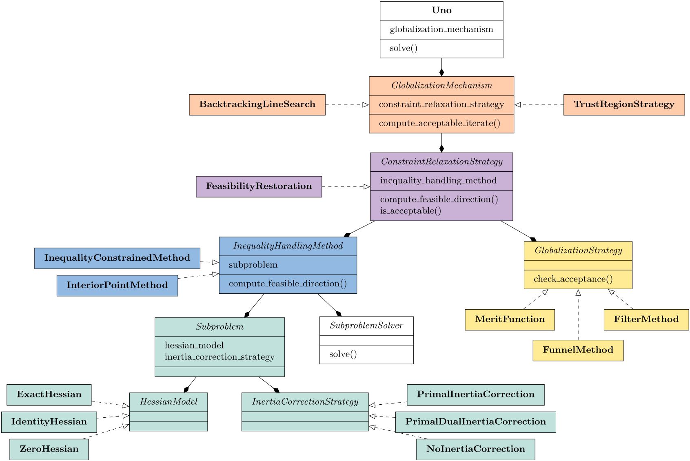
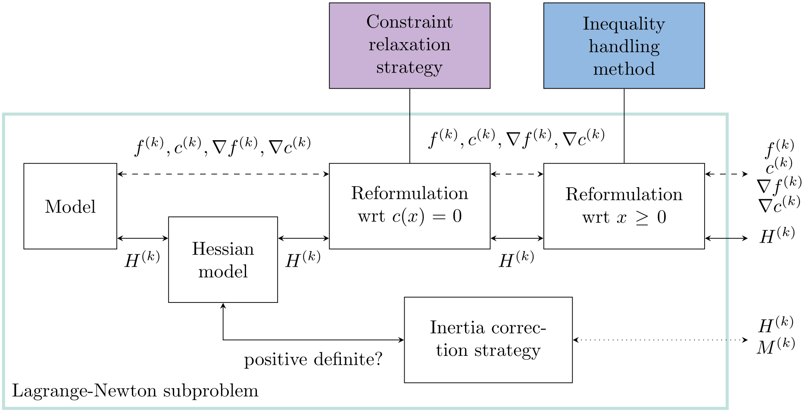

# Uno: a unified solver for nonlinearly constrained optimization

We have implemented our unifying framework for nonlinearly constrained optimization within Uno, a modular solver written in C++17. A generic and flexible code, it supports a broad range of strategies that can be combined automatically and on the fly with no programming effort from the user. The code is packaged in a lightweight library (around 10,000 lines of code for the current version, excluding interfaces) available as open-source software under the MIT license at https://github.com/cvanaret/Uno. Uno is available via its C, Julia (registered package `UnoSolver.jl`), Python (the packaging of `unopy` is under development), Fortran, and AMPL interfaces.

## Generic architecture

The modularity of Uno stems from its generic architecture: each ingredient is implemented once and independently of the others, which improves readability, and makes building blocks less prone to error and easier to maintain than monolithic codes.

Figure 3 represents Uno's object-oriented architecture as a Unified Modeling Language (UML) diagram based on inheritance ("is a") and composition ("has a"). The ingredients are modeled as abstract classes: they define interfaces, that is, generic actions and behaviors that must be implemented by concrete strategies modeled as subclasses. For example:
- the classes `BacktrackingLineSearch` and `TrustRegionStrategy` inherit from the abstract class `GlobalizationMechanism` and thus must implement the purely virtual member function `compute_acceptable_iterate()`;
- the `GlobalizationMechanism` class possesses a member of type `ConstraintRelaxationStrategy`.

**Figure 3.** Uno's UML diagram.

## Automatic strategy combinations

Uno implements state-of-the-art strategies that can be combined automatically thanks to the modular software architecture. The number of possible strategy combinations is the size of the Cartesian product of the eight ingredients. Note that all combinations do not necessarily result in sensible algorithms, or even convergent approaches.

At the moment, Uno prohibits the combination of interior-point methods and trust-region strategies. A possible strategy is KNITRO's step decomposition: the direction is decomposed into a normal step that minimizes the constraint violation within the trust region, and a tangential step that minimizes the objective for a given constraint violation target within the trust region. This limitation will be resolved in later Uno versions.

Some strategy combinations are available as "presets" that automatically connect the eight ingredients and set values for the hyperparameters. The following presets are available:
- **`filtersqp`**: A trust-region restoration filter SQP method à la filterSQP. Second-order correction steps were not implemented.
- **`ipopt`**: A line-search restoration filter interior-point method à la IPOPT. Second-order correction steps, scaling, least-square multipliers, iterative refinement, iterative bound relaxations, non-monotone techniques, and soft feasibility restoration were not implemented.

## Features of Uno

### Interfaces to subproblem solvers

Interfaces to the following subproblem solvers are available:
- **BQPD**: a null-space active-set solver for nonconvex QPs. BQPD accepts Hessian-vector products instead of an explicit matrix;
- **MA57**, **MA27**, and **MUMPS**: direct solvers for sparse symmetric indefinite linear systems;
- **HiGHS**: a parallel simplex implementation for linear programming.

### Definition of the subproblem

The constraint relaxation strategy and the inequality handling method successively reformulate the original problem with respect to the general constraints $c(x) = 0$ and the bound constraints $x \ge 0$. A local model of the resulting reformulated problem is then built.

The Lagrange-Newton subproblem is composed of the following elements: the reformulated problem, the current primal-dual iterate, the Hessian model, the inertia correction strategy, and a possible trust-region radius. These elements interact with one another to automatically define the progress measures and their local models, the Lagrangian Hessian or augmented matrix with the correct inertia, and the type of subproblem solvers that can be used.

The subproblem is represented schematically in Figure 4.

**Figure 4.** Definition of a `Subproblem`.

### Definition of progress measures

The progress measures are defined automatically by the successive reformulations of the optimization problem (`l1RelaxedProblem` and `PrimalDualInteriorPointProblem`):
- the norm of the infeasibility measure is determined by that of the feasibility problem or that of the relaxed problem;
- the objective measure is $\omega_\pi(x) \stackrel{\text{def}}{=} \pi f(x)$ (for all the currently implemented strategies);
- the auxiliary measure accumulates proximal (in the feasibility problem `l1RelaxedProblem`) and barrier (in `PrimalDualInteriorPointProblem`) terms.

### Inertia correction

Each Hessian model declares whether it is positive definite, and whether it is available as an explicit matrix and as a linear operator. The inertia of the Lagrangian Hessian is corrected if:
- the Hessian model is not already positive definite; and
- the Hessian model is available as an explicit matrix; and
- the inertia correction strategy performs primal correction ("primal" or "primal-dual").

### Instantiation of ingredients

Most ingredients are picked by the user via options. The following ingredients may be set or overridden by Uno after analyzing the problem:
- for inequality-constrained methods, the subproblem solver is picked depending whether the subproblems have curvature;
- if the reformulated problem is unconstrained, the constraint relaxation strategy is set to the custom `NoRelaxation` strategy, the globalization strategy is set to `l1MeritFunction`, and if there is no curvature in the subproblem, the subproblem solver is set to the custom `BoxLPSolver`;
- if the Hessian model is "exact" but neither an explicit Hessian matrix nor a Hessian linear operator was provided by the modeler, the Hessian model is set to "zero" and a warning message is printed.

### Sparse matrix formats

Each subproblem solver possesses an object that inherits from the abstract class `EvaluationSpace` in which they store the Jacobian matrix, the Hessian matrix, or the augmented matrix in specific sparse formats:
- BQPD expects a Jacobian in Compressed Sparse Row (CSR) format;
- MA57, MA27, and MUMPS expect a matrix in COOrdinate (COO) format;
- HiGHS expects the Jacobian in Compressed Sparse (Row or Column) format.

### Termination criteria

Uno terminates at the primal-dual iterate $(x^*, y^*, z^*, \pi^*)$ if:
- sufficient first-order optimality conditions are approximately satisfied:
  - a **feasible KKT point** (CQ holds) if it satisfies stationarity, primal feasibility, dual feasibility, and complementarity with $\pi^* > 0$;
  - a **feasible FJ point** (CQ does not hold) if it satisfies these conditions with $\pi^* = 0$;
  - an **infeasible stationary point** (a minimum of the constraint violation) if it satisfies stationarity and dual feasibility with $\pi^* = 0$, no primal feasibility and a complementarity condition on the violated constraints;
- primal feasibility is approximately satisfied and the trust-region radius is close to machine epsilon;
- the first-order optimality conditions cannot be satisfied for the user-defined tolerance $\varepsilon$ but are satisfied for a looser tolerance for a certain number of consecutive iterations.

### Error handling

Uno terminates with an error message if it encounters an IEEE exception at the initial point $x^{(0)}$. Otherwise, it tries to recover from IEEE exceptions during the optimization process by invoking the globalization mechanism: reducing the current trust-region radius or reducing the tentative step length in the backtracking line search.