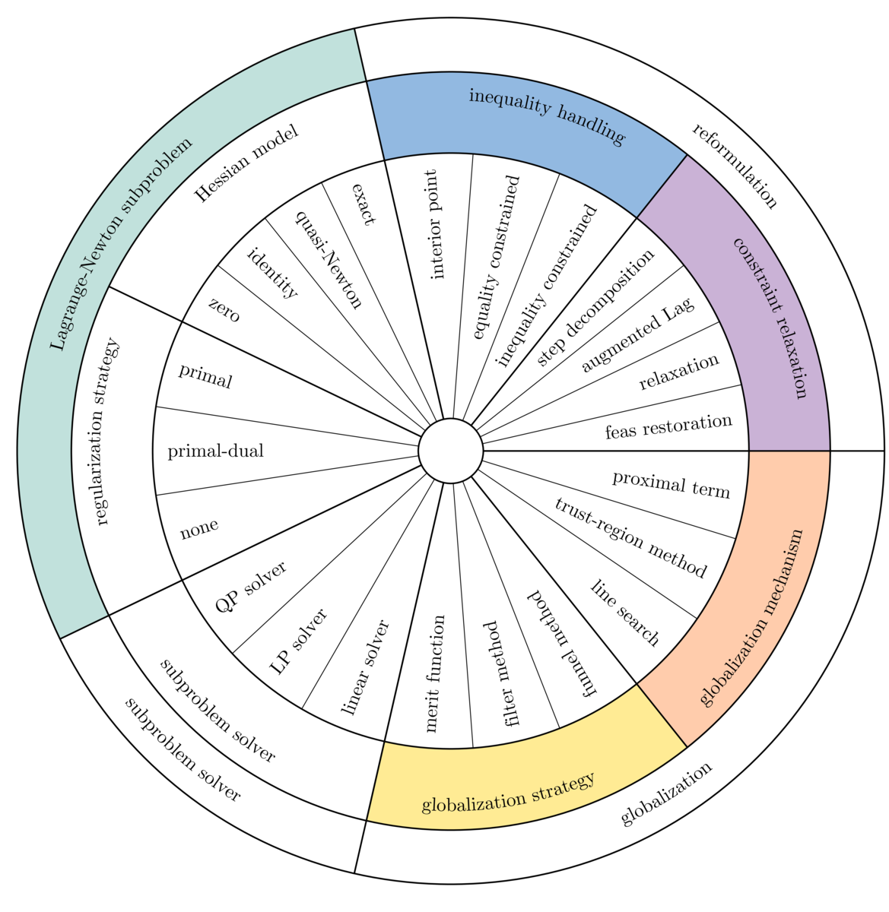

# Summary

Uno is a composable software framework for nonlinearly constrained optimization written in modern C\texttt{++}.
It unifies the workflows of Lagrange-Newton methods, i.e., gradient-based algorithms that iteratively solve the KKT optimality conditions with Newton's method.
As of February 2026, Uno supports sequential (convex and nonconvex) quadratic programming, interior-point (barrier) methods, and sequential linear programming.

Uno breaks down optimization algorithms into reusable modular components such as step computation, constraint reformulation, globalization techniques, and acceptance criteria.
This allows classical and hybrid methods to be configured and compared within a single framework.

The core C\texttt{++} code of Uno is organized into modular, object-oriented components that separate the mathematical logic of the algorithms from implementation details such as memory management, data structures, and computational routines.
For full mathematical details of the algorithms implemented in Uno, see [@VanaretLeyffer2024].
Uno also provides bindings for Julia, Python, C, and Fortran for use across scientific computing environments.
Precompiled artifacts are available on GitHub, and the solver can be accessed directly via `UnoSolver.jl` in Julia or `unopy` in Python.

# Statement of need

Nonlinearly constrained optimization is central to engineering, optimal control, machine learning, and scientific modeling [@nocedal2006].
It also plays a key role in mixed-integer nonlinear optimization (MINLP) [@lee2011].

Popular solvers such as Ipopt [@wachter2005], KNITRO [@byrd2006], and SNOPT [@gill2005] are efficient, but typically monolithic.
They expose parameter tuning while keeping internal algorithmic components rigid and inaccessible.
This limits algorithmic research, making it hard to prototype hybrid methods, systematically compare strategies, or teach the underlying techniques.

Uno addresses these gaps by providing a composable framework in which algorithms emerge from modular, code-level building blocks corresponding to mathematical concepts such as step computation, constraint reformulation, and globalization strategies.
It enables rapid prototyping of new methods, serving both research and educational purposes.

Typical nonlinear solvers implement strategies such as sequential quadratic programming, interior-point methods, and augmented Lagrangian methods.
In Uno, these strategies are organized into a wheel of layers and ingredients, illustrated in \autoref{fig:wheel}.
(TODO: use 2 different colors: one for implemented, one for not yet).

{ width=60% }

# Software design

The architecture of Uno follows a usual object-oriented design in which abstract classes define interfaces that should be implemented by subclasses.
For instance, `BacktrackingLineSearch` and `TrustRegionMethod` both inherit from the abstract class `GlobalizationMechanism` and implement its interface.

# Interfaces

To make Uno accessible to a wide range of users, we provide multiple language interfaces.

The first interface is based on AMPL [@fourer1990], a widely used modeling language for optimization problems.
It is distributed as a binary that takes a compiled AMPL model (.nl file) as input, allowing users to solve problems without directly interacting with the C\texttt{++} core.

The second interface is based on C and provides direct access to Uno's core functionality while maximizing interoperability with other programming languages and tools.
It is centered around two main structures:

* **Model**: represents an optimization problem and stores information about variables, bounds, constraints, the objective function, and derivative information. Users create a model and set its components (objective, constraints, derivatives, initial iterates).
* **Solver**: represents the algorithm used to solve a given model. Users configure solver options, attach callbacks, and access results such as primal and dual solutions, residuals, iteration counts, and performance metrics.

The optimization phase requires both the model and the solver as input.

The third interface is based on Fortran and provides access to Uno through the C API using `iso_c_binding`.
It is split into two files: `uno_c.f90` for low-level C bindings, and `uno_fortran.f90` for Fortran-friendly wrappers that handle string arguments.
The interface can be included directly in a source file or wrapped in a module for cleaner `use` statements.
It is provided as source rather than a precompiled module to maximize portability and interoperability across compilers and platforms.

The fourth interface is based on Julia and is available as the registered Julia package `UnoSolver.jl`.
It provides direct integration with the Julia optimization ecosystem through:

* a thin wrapper around the full C API,
* an interface to `NLPModels.jl` for solving problems following the NLPModels API, such as `ADNLPModels.jl` or `ExaModels.jl`,
* an interface to `MathOptInterface.jl` for handling JuMP models.

All precompiled artifacts are automatically downloaded, making the package plug-and-play without requiring compilation from users.

The fifth interface is based on Python and is available on PyPI as `unopy`.
It provides access to Uno through precompiled wheels on most platforms, allowing users to define models, configure solvers, and retrieve solutions directly from Python.

A MATLAB interface is also under development, further expanding Uno's accessibility.

# References
